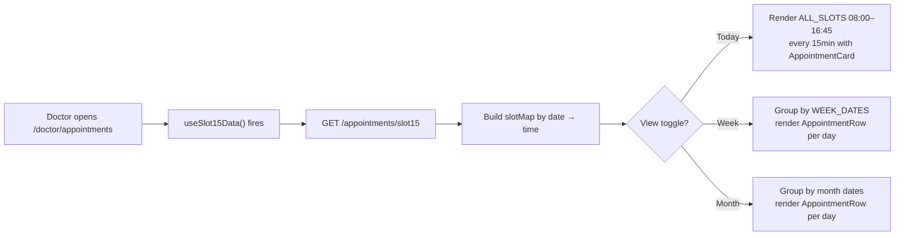
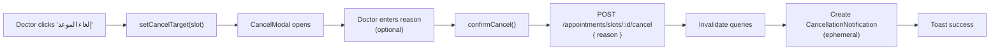
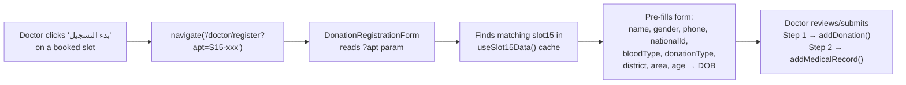
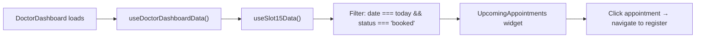
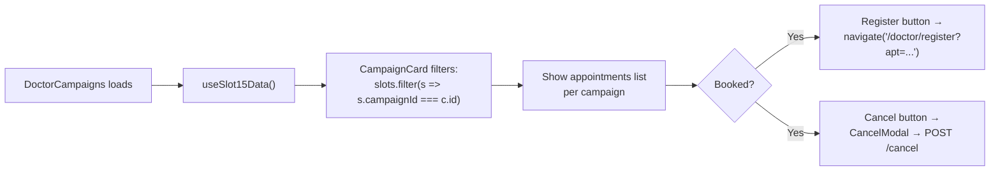
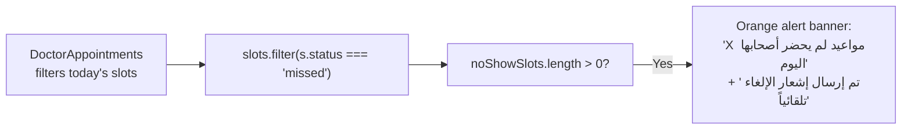

# 🩸 Appointments Module — Complete Analysis & Backend API Contract

---

## Table of Contents

1. [Module Architecture Map](#1-module-architecture-map)
2. [Existing Endpoints (from codebase)](#2-existing-endpoints-from-codebase)
3. [UI & Business Flow Analysis](#3-ui--business-flow-analysis)
4. [Gap Analysis — Missing Endpoints](#4-gap-analysis--missing-endpoints)
5. [Complete Backend API Contract](#5-complete-backend-api-contract)
6. [Ambiguities & Open Questions](#6-ambiguities--open-questions)

---

## 1. Module Architecture Map

### Files Involved

| Layer | File | Purpose |
|-------|------|---------|
| **Types** | [appointment.ts](file:///d:/Graduation!!!/Blood-Bank-System/src/app/types/appointment.ts) | `AppointmentSlot`, `AppointmentBooking`, `Slot15`, `Slot15Status`, `CancellationNotification`, `TimeSlot`, `AppointmentDay` |
| **Types** | [common.ts](file:///d:/Graduation!!!/Blood-Bank-System/src/app/types/common.ts) | `PaginatedResponse<T>`, `BloodType`, `DonationType` |
| **API Layer** | [appointments.ts](file:///d:/Graduation!!!/Blood-Bank-System/src/app/api/appointments.ts) | 3 functions: `fetchAppointmentSlots`, `fetchSlot15Data`, `cancelAppointment` |
| **API Client** | [client.ts](file:///d:/Graduation!!!/Blood-Bank-System/src/app/api/client.ts) | Axios instance, base URL: `/api/v1/system`, cookie auth, silent 401 refresh |
| **Mock Data** | [appointments.mock.ts](file:///d:/Graduation!!!/Blood-Bank-System/src/app/data/appointments.mock.ts) | 33 `Slot15` records, 29 `AppointmentSlot` records |
| **Hooks** | [useAppointments.ts](file:///d:/Graduation!!!/Blood-Bank-System/src/app/hooks/useAppointments.ts) | `useAppointmentSlots`, `useSlot15Data`, `useCancelAppointment` |
| **Page** | [DoctorAppointments.tsx](file:///d:/Graduation!!!/Blood-Bank-System/src/app/components/doctor/DoctorAppointments.tsx) | Main appointments page — today/week/month views, filters, stats, cancel flow |
| **Component** | [AppointmentCard.tsx](file:///d:/Graduation!!!/Blood-Bank-System/src/app/components/doctor/doctor-appointments/AppointmentCard.tsx) | Detailed card (today view) — donor info, blood type, donation type, campaign badge, cancel/register buttons |
| **Component** | [AppointmentRow.tsx](file:///d:/Graduation!!!/Blood-Bank-System/src/app/components/doctor/doctor-appointments/AppointmentRow.tsx) | Compact row (week/month view) — same actions |
| **Component** | [NotificationsPanel.tsx](file:///d:/Graduation!!!/Blood-Bank-System/src/app/components/doctor/doctor-appointments/NotificationsPanel.tsx) | In-session cancellation notifications (ephemeral, not persisted) |
| **Component** | [CancelModal.tsx](file:///d:/Graduation!!!/Blood-Bank-System/src/app/components/shared/CancelModal.tsx) | Confirmation dialog — displays slot info, campaign, doctor name, reason textarea |
| **Constants** | [appointmentConstants.tsx](file:///d:/Graduation!!!/Blood-Bank-System/src/app/components/doctor/doctor-appointments/appointmentConstants.tsx) | `ALL_SLOTS` (08:00–16:45 every 15min), `WEEK_DATES`, `isSlotPast`, `getEffectiveStatus`, `STATUS_CONFIG` |
| **Dashboard** | [UpcomingAppointments.tsx](file:///d:/Graduation!!!/Blood-Bank-System/src/app/components/doctor/doctor-dashboard/UpcomingAppointments.tsx) | Dashboard widget showing today's booked appointments |
| **Dashboard Hook** | [useDoctorDashboardData.ts](file:///d:/Graduation!!!/Blood-Bank-System/src/app/components/doctor/hooks/useDoctorDashboardData.ts) | Aggregates `useSlot15Data` for `upcomingToday` calculation |
| **Campaigns** | [DoctorCampaigns.tsx](file:///d:/Graduation!!!/Blood-Bank-System/src/app/components/doctor/DoctorCampaigns.tsx) | Uses `useSlot15Data` + `useCancelAppointment` to show/cancel campaign appointments |
| **Campaign Card** | [CampaignCard.tsx](file:///d:/Graduation!!!/Blood-Bank-System/src/app/components/doctor/doctor-campaigns/CampaignCard.tsx) | Filters slots by `campaignId`, shows register/cancel per slot |
| **Registration** | [DonationRegistrationForm.tsx](file:///d:/Graduation!!!/Blood-Bank-System/src/app/components/doctor/DonationRegistrationForm.tsx) | Pre-fills donor data from `?apt=S15-xxx` query param using `useSlot15Data` |
| **Navigation** | [DoctorLayout.tsx](file:///d:/Graduation!!!/Blood-Bank-System/src/app/components/layout/DoctorLayout.tsx) | Sidebar nav item: `/doctor/appointments` → "المواعيد" |
| **Routes** | [routes.tsx](file:///d:/Graduation!!!/Blood-Bank-System/src/app/routes.tsx) | `{ path: 'appointments', Component: DoctorAppointments }` |

---

## 2. Existing Endpoints (from codebase)

These are the 3 endpoints explicitly coded in [appointments.ts](file:///d:/Graduation!!!/Blood-Bank-System/src/app/api/appointments.ts):

---

### EP-1: Fetch Appointment Slots (Admin/Scheduling View)

| Field | Value |
|-------|-------|
| **HTTP Method** | `GET` |
| **Endpoint** | `/appointments/slots` |
| **Path Params** | None |
| **Query Params** | None currently — but `PaginatedResponse` wrapper implies `page`, `limit` are expected |
| **Request Body** | None |
| **Response** | `PaginatedResponse<AppointmentSlot>` |
| **Status Codes** | `200 OK`, `401 Unauthorized`, `500 Internal Server Error` |

**Response structure:**

```typescript
{
  data: [
    {
      id: string;              // "SL-001"
      date: string;            // "2026-05-24" (ISO date)
      time: string;            // "08:00" (HH:mm)
      capacity: number;        // 3
      isDisabled: boolean;     // false
      campaignId?: string;     // "CAM-001" (optional)
      bookings: [
        {
          id: string;          // "BK-001"
          donorName: string;
          donorCode?: string;  // "DNR-2025-0001"
          phone: string;
          bloodType?: BloodType;
          source: "app" | "manual";
          status: "confirmed" | "cancelled";
        }
      ];
    }
  ],
  total: number,
  page: number,
  limit: number
}
```

> [!NOTE]
> This endpoint provides a **scheduling-centric** view: time slots with their capacity and nested bookings. It is used by `useAppointmentSlots()` but **no component currently consumes this hook**. The doctor-facing pages all use `useSlot15Data()` instead. This suggests `AppointmentSlot` was designed for an admin scheduling UI that hasn't been built yet, or for the mobile app's booking flow.

---

### EP-2: Fetch 15-Minute Slot Data (Doctor View)

| Field | Value |
|-------|-------|
| **HTTP Method** | `GET` |
| **Endpoint** | `/appointments/slot15` |
| **Path Params** | None |
| **Query Params** | None currently — returns ALL slots across all dates |
| **Request Body** | None |
| **Response** | `PaginatedResponse<Slot15>` |
| **Status Codes** | `200 OK`, `401 Unauthorized`, `500 Internal Server Error` |

**Response structure:**

```typescript
{
  data: [
    {
      id: string;                    // "S15-001"
      date: string;                  // "2026-05-24"
      time: string;                  // "08:00"
      donorName?: string;
      donorCode?: string;            // "DNR-2025-0001"
      donorNationalId?: string;      // "29701010001234" (14-digit Egyptian NID)
      donorPhone?: string;
      donorBloodType?: BloodType;    // "O+" | "A+" | ...
      donorGender?: "male" | "female";
      donorAge?: number;
      donorDistrict?: string;
      donorArea?: string;
      donationType?: DonationType;   // "wholeblood" | "plasma" | "platelets"
      status: Slot15Status;          // "available" | "booked" | "completed" | "missed" | "disabled" | "cancelled"
      campaignId?: string;
      notes?: string;
      completedAt?: string;          // Time string e.g. "08:12"
      cancelledAt?: string;          // ISO datetime or time string
      cancelledBy?: string;          // User ID
      cancelledByName?: string;      // Display name
      cancellationReason?: string;
    }
  ],
  total: number,
  page: number,
  limit: number
}
```

> [!IMPORTANT]
> This is the **primary endpoint consumed by all doctor-facing UI**. It's called from:
> - `DoctorAppointments` page (today/week/month views)
> - `DoctorDashboard` (upcoming today widget)
> - `DoctorCampaigns` (campaign appointment list)
> - `DonationRegistrationForm` (pre-fill from `?apt=`)

---

### EP-3: Cancel Appointment

| Field | Value |
|-------|-------|
| **HTTP Method** | `POST` |
| **Endpoint** | `/appointments/slots/{slotId}/cancel` |
| **Path Params** | `slotId` — the `Slot15.id` (e.g., `"S15-009"`) |
| **Query Params** | None |
| **Request Body** | `{ reason: string }` (reason may be empty — UI marks it as optional) |
| **Response** | `void` (204 No Content or 200 with empty body) |
| **Status Codes** | `200/204 OK`, `400 Bad Request` (invalid slot state), `404 Not Found`, `401 Unauthorized` |

**Called from:**
- `DoctorAppointments.tsx` → `confirmCancel()` → via `useCancelAppointment` mutation
- `DoctorCampaigns.tsx` → `CancelModal` → via same mutation

**Side effects on success:**
- Invalidates React Query keys: `['appointment-slots']`, `['slot15']`
- UI creates ephemeral `CancellationNotification` in session state
- Toast: "تم إلغاء الموعد بنجاح"

---

## 3. UI & Business Flow Analysis

### Flow 1: View Appointments (Today/Week/Month)



**Observations:**
- All slots for all dates are fetched in **a single request** — no date filtering query params
- `getEffectiveStatus()` transforms raw `Slot15Status` into UI-effective status:
  - `booked` + past time → `cancelled` (client-side derivation)
  - `missed` → `no_show`
  - `disabled` → `cancelled`
- Stats cards (booked/completed/no_show/cancelled) are computed **client-side** from today's slots
- Filter by status is also **client-side** (no server filtering)

---

### Flow 2: Cancel Appointment



**Key detail:** The UI assumes the backend will:
1. Update the slot status to `'cancelled'`
2. Set `cancelledAt`, `cancelledBy`, `cancelledByName`, `cancellationReason` fields
3. The UI text says: "سيتم إلغاء هذا الموعد فوراً وإرسال إشعار تلقائي للمتبرع" — implies the backend sends a push notification to the donor

---

### Flow 3: Register Donation from Appointment



> [!IMPORTANT]
> After completing the donation registration, **nothing in the current code marks the appointment as `'completed'`**. The `Slot15.status` stays `'booked'` unless the backend handles this automatically. This is a **critical gap**.

---

### Flow 4: Dashboard — Upcoming Appointments Widget



---

### Flow 5: Campaign Appointments



---

### Flow 6: No-Show Alert



> [!WARNING]
> The UI expects the backend to mark slots as `'missed'` (no-show) — possibly via a scheduled job or an explicit doctor action. **There is no endpoint or UI action to trigger this transition.** The mock data has hardcoded `status: 'missed'` entries.

---

## 4. Gap Analysis — Missing Endpoints

Based on the complete analysis of UI flows, business logic, and type definitions, the following endpoints are **required but not yet implemented** in the API layer:

---

### GAP-1: Fetch Slot15 Data with Date Filtering

**Evidence:** The UI fetches ALL slots and filters client-side. For production with months of data, this is unsustainable.

```
Method:   GET
Endpoint: /appointments/slot15
Purpose:  Fetch slot15 data with date range, status, and pagination filters
Request:  Query params: ?dateFrom=2026-05-24&dateTo=2026-05-30&status=booked&page=1&limit=50
Response: PaginatedResponse<Slot15>
```

---

### GAP-2: Fetch Single Slot15 by ID

**Evidence:** `DonationRegistrationForm` looks up a specific slot by `?apt=S15-xxx` from the full in-memory list. A dedicated endpoint would be more efficient.

```
Method:   GET
Endpoint: /appointments/slot15/{slotId}
Purpose:  Fetch a single Slot15 record by ID for pre-filling the registration form
Request:  Path param: slotId
Response: ApiResponse<Slot15>
```

---

### GAP-3: Complete Appointment (Mark as Completed)

**Evidence:** After a doctor registers a donation from a booked appointment, the slot must transition from `'booked'` → `'completed'`. The type system defines `completedAt` field. No current endpoint does this. The mock data has `status: 'completed'` + `completedAt: '08:12'` entries.

```
Method:   POST
Endpoint: /appointments/slot15/{slotId}/complete
Purpose:  Mark an appointment as completed after donation registration
Request:  { completedAt?: string }  (optional — server can default to now)
Response: void (204)
```

---

### GAP-4: Mark Appointment as No-Show (Missed)

**Evidence:** The UI displays a no-show alert for `status === 'missed'` slots. The type defines `'missed'` status. No endpoint or UI action triggers this transition. The text says "تم إرسال إشعار الإلغاء تلقائياً" implying automated detection.

```
Method:   POST
Endpoint: /appointments/slot15/{slotId}/no-show
Purpose:  Mark an appointment as missed (no-show) — either by doctor or automated job
Request:  { notes?: string }
Response: void (204)
```

---

### GAP-5: Create / Manage Appointment Slots (Admin)

**Evidence:** The `AppointmentSlot` type with `capacity` and `isDisabled` fields exists. Mock data shows slots with varying capacities (3 or 4) and `isDisabled: true` for some time slots. The `useAppointmentSlots` hook exists. This implies an admin/scheduling interface.

```
Method:   POST
Endpoint: /appointments/slots
Purpose:  Create new appointment slots for a given date
Request:  {
            date: string,
            time: string,
            capacity: number,
            campaignId?: string
          }
Response: ApiResponse<AppointmentSlot>
```

---

### GAP-6: Update / Disable Appointment Slot

**Evidence:** `isDisabled: true` exists in mock data for some slots (e.g., SL-007, SL-008 at 11:00, 11:30). The `getEffectiveStatus()` maps `disabled` → `cancelled`. This implies an admin can disable slots.

```
Method:   PATCH
Endpoint: /appointments/slots/{slotId}
Purpose:  Update slot capacity or toggle disabled state
Request:  {
            capacity?: number,
            isDisabled?: boolean,
            campaignId?: string | null
          }
Response: ApiResponse<AppointmentSlot>
```

---

### GAP-7: Create Booking in Slot (Manual/Admin)

**Evidence:** `AppointmentBooking` type has `source: 'app' | 'manual'`. Mock data shows bookings with `source: 'manual'` — these are added by staff, not the mobile app. No endpoint exists for this.

```
Method:   POST
Endpoint: /appointments/slots/{slotId}/bookings
Purpose:  Manually add a donor booking to a slot (by staff/doctor)
Request:  {
            donorName: string,
            donorCode?: string,
            phone: string,
            bloodType?: BloodType,
            source: "manual"
          }
Response: ApiResponse<AppointmentBooking>
```

---

### GAP-8: Cancel Booking in Slot

**Evidence:** `AppointmentBooking.status` can be `'cancelled'`. There is no endpoint to cancel an individual booking (vs. the slot-level cancel in EP-3).

```
Method:   POST
Endpoint: /appointments/slots/{slotId}/bookings/{bookingId}/cancel
Purpose:  Cancel a specific booking within a slot
Request:  { reason?: string }
Response: void (204)
```

---

### GAP-9: Fetch Appointment Statistics

**Evidence:** The dashboard computes stats client-side: `booked`, `completed`, `no_show`, `cancelled` counts for today. A dedicated stats endpoint would be more efficient.

```
Method:   GET
Endpoint: /appointments/stats
Purpose:  Get appointment statistics for a date range
Request:  Query params: ?date=2026-05-24 (or dateFrom/dateTo)
Response: {
            data: {
              booked: number,
              completed: number,
              missed: number,
              cancelled: number,
              total: number
            }
          }
```

---

### GAP-10: Fetch Campaign Appointments

**Evidence:** `DoctorCampaigns` and `CampaignCard` filter all slot15 data by `campaignId`. A dedicated query would avoid loading all appointments.

```
Method:   GET
Endpoint: /appointments/slot15?campaignId={campaignId}
Purpose:  Fetch appointments linked to a specific campaign
Request:  Query param: campaignId
Response: PaginatedResponse<Slot15>
```

> [!NOTE]
> This can be handled as a query parameter on the existing `/appointments/slot15` endpoint (GAP-1) rather than a separate endpoint.

---

### GAP-11: Link Appointment to Donation (Post-Registration)

**Evidence:** When a doctor registers a donation from `?apt=S15-xxx`, the donation should be linked back to the appointment. Currently `addDonation()` payload has no `appointmentId` field. The `Slot15` should transition to `completed` and reference the donation.

```
Method:   POST
Endpoint: /appointments/slot15/{slotId}/link-donation
Purpose:  Link a completed donation to its source appointment
Request:  { donationId: string }
Response: void (204)
```

> [!TIP]
> Alternatively, this can be handled by adding an `appointmentId` field to the `addDonation()` request payload, and having the backend mark the appointment as completed automatically.

---

## 5. Complete Backend API Contract

> [!IMPORTANT]
> **Base URL**: `/api/v1/system`
> **Auth**: HttpOnly cookie-based (JWT). All endpoints require authentication.
> **Content-Type**: `application/json`

---

### 5.1 Appointment Slots (Scheduling / Admin View)

---

#### `GET /appointments/slots`

**Purpose:** Fetch appointment slots with capacity and nested bookings.

| Parameter | Type | In | Required | Description |
|-----------|------|----|----------|-------------|
| `date` | string | query | No | Filter by specific date (ISO: `YYYY-MM-DD`) |
| `dateFrom` | string | query | No | Start of date range |
| `dateTo` | string | query | No | End of date range |
| `campaignId` | string | query | No | Filter by campaign |
| `page` | number | query | No | Page number (default: 1) |
| `limit` | number | query | No | Items per page (default: 20) |

**Response `200 OK`:**

```json
{
  "data": [
    {
      "id": "SL-001",
      "date": "2026-05-24",
      "time": "08:00",
      "capacity": 3,
      "isDisabled": false,
      "campaignId": null,
      "bookings": [
        {
          "id": "BK-001",
          "donorName": "كريم محمود أحمد",
          "donorCode": "DNR-2025-0001",
          "phone": "01012345678",
          "bloodType": "O+",
          "source": "app",
          "status": "confirmed"
        }
      ]
    }
  ],
  "total": 29,
  "page": 1,
  "limit": 20
}
```

**Error responses:** `401 Unauthorized`, `500 Internal Server Error`

---

#### `POST /appointments/slots` *(NEW)*

**Purpose:** Create a new appointment slot.

**Request body:**

```json
{
  "date": "2026-06-01",
  "time": "08:00",
  "capacity": 3,
  "campaignId": "CAM-001"
}
```

| Field | Type | Required | Constraints |
|-------|------|----------|-------------|
| `date` | string | Yes | ISO date `YYYY-MM-DD`, must be today or future |
| `time` | string | Yes | `HH:mm` format, must be on 15-min boundary |
| `capacity` | number | Yes | Min: 1 |
| `campaignId` | string | No | Must reference existing active campaign |

**Response `201 Created`:**

```json
{
  "data": {
    "id": "SL-030",
    "date": "2026-06-01",
    "time": "08:00",
    "capacity": 3,
    "isDisabled": false,
    "campaignId": "CAM-001",
    "bookings": []
  }
}
```

**Error responses:** `400 Bad Request` (validation), `401`, `409 Conflict` (slot already exists for date+time)

---

#### `PATCH /appointments/slots/{slotId}` *(NEW)*

**Purpose:** Update slot capacity or disable/enable it.

**Path params:** `slotId` (string)

**Request body (partial):**

```json
{
  "capacity": 4,
  "isDisabled": true,
  "campaignId": null
}
```

**Response `200 OK`:** Updated `AppointmentSlot` object

**Error responses:** `400`, `401`, `404 Not Found`

---

#### `POST /appointments/slots/{slotId}/bookings` *(NEW)*

**Purpose:** Manually book a donor into a slot (by staff).

**Path params:** `slotId` (string)

**Request body:**

```json
{
  "donorName": "فاطمة عبد الرحيم",
  "donorCode": null,
  "phone": "01066554433",
  "bloodType": null,
  "source": "manual"
}
```

**Response `201 Created`:**

```json
{
  "data": {
    "id": "BK-028",
    "donorName": "فاطمة عبد الرحيم",
    "phone": "01066554433",
    "source": "manual",
    "status": "confirmed"
  }
}
```

**Error responses:** `400` (slot full / disabled), `401`, `404`

---

#### `POST /appointments/slots/{slotId}/bookings/{bookingId}/cancel` *(NEW)*

**Purpose:** Cancel a specific booking.

**Path params:** `slotId`, `bookingId` (strings)

**Request body:**

```json
{
  "reason": "ظروف طارئة"
}
```

**Response:** `204 No Content`

**Error responses:** `400` (already cancelled), `401`, `404`

---

### 5.2 Slot15 — Doctor View (Primary Endpoints)

---

#### `GET /appointments/slot15`

**Purpose:** Fetch 15-minute granularity slot data for the doctor interface.

| Parameter | Type | In | Required | Description |
|-----------|------|----|----------|-------------|
| `date` | string | query | No | Filter by specific date |
| `dateFrom` | string | query | No | Start of date range |
| `dateTo` | string | query | No | End of date range |
| `status` | string | query | No | Filter by status: `available`, `booked`, `completed`, `missed`, `disabled`, `cancelled` |
| `campaignId` | string | query | No | Filter by campaign |
| `page` | number | query | No | Default: 1 |
| `limit` | number | query | No | Default: 100 |

**Response `200 OK`:**

```json
{
  "data": [
    {
      "id": "S15-001",
      "date": "2026-05-24",
      "time": "08:00",
      "donorName": "كريم محمود أحمد",
      "donorCode": "DNR-2025-0001",
      "donorNationalId": "29701010001234",
      "donorPhone": "01012345678",
      "donorBloodType": "O+",
      "donorGender": "male",
      "donorAge": 28,
      "donorDistrict": "بني سويف",
      "donorArea": "شارع النيل",
      "donationType": "wholeblood",
      "status": "completed",
      "campaignId": null,
      "notes": null,
      "completedAt": "08:12",
      "cancelledAt": null,
      "cancelledBy": null,
      "cancelledByName": null,
      "cancellationReason": null
    }
  ],
  "total": 33,
  "page": 1,
  "limit": 100
}
```

**Error responses:** `401`, `500`

---

#### `GET /appointments/slot15/{slotId}` *(NEW)*

**Purpose:** Fetch a single Slot15 record by ID.

**Path params:** `slotId` (string, e.g. `"S15-009"`)

**Response `200 OK`:**

```json
{
  "data": {
    "id": "S15-009",
    "date": "2026-05-24",
    "time": "13:00",
    "donorName": "سامي عبد الله نور",
    "donorCode": null,
    "donorNationalId": "29501250044556",
    "donorPhone": "01366554433",
    "donorBloodType": "O+",
    "donorGender": "male",
    "donorAge": 32,
    "donorDistrict": "بني سويف",
    "donorArea": "كورنيش النيل",
    "donationType": "wholeblood",
    "status": "booked",
    "campaignId": null,
    "notes": null,
    "completedAt": null,
    "cancelledAt": null,
    "cancelledBy": null,
    "cancelledByName": null,
    "cancellationReason": null
  }
}
```

**Error responses:** `401`, `404 Not Found`

---

#### `POST /appointments/slots/{slotId}/cancel`

**Purpose:** Cancel an appointment slot.

**Path params:** `slotId` (string)

**Request body:**

```json
{
  "reason": "تعارض في المواعيد"
}
```

| Field | Type | Required | Constraints |
|-------|------|----------|-------------|
| `reason` | string | No | Max 500 chars. UI marks it as optional. |

**Response:** `204 No Content`

**Backend side effects:**
- Set `status` → `"cancelled"`
- Set `cancelledAt` → current ISO datetime
- Set `cancelledBy` → authenticated user ID
- Set `cancelledByName` → authenticated user display name
- Set `cancellationReason` → provided reason
- Send push notification to donor (per UI text: "إرسال إشعار تلقائي للمتبرع")
- Make the time slot available for re-booking (per UI text: "الفترة الزمنية متاحة للحجز مجدداً")

**Error responses:** `400 Bad Request` (slot not in cancellable state), `401`, `404`

---

#### `POST /appointments/slot15/{slotId}/complete` *(NEW)*

**Purpose:** Mark appointment as completed after a donation is registered.

**Path params:** `slotId` (string)

**Request body:**

```json
{
  "donationId": "DONATION-12345",
  "completedAt": "08:12"
}
```

| Field | Type | Required | Description |
|-------|------|----------|-------------|
| `donationId` | string | No | Link to the created donation record |
| `completedAt` | string | No | Time of completion. Server defaults to now if omitted. |

**Response:** `204 No Content`

**Backend side effects:**
- Set `status` → `"completed"`
- Set `completedAt`

**Error responses:** `400` (not in `booked` state), `401`, `404`

---

#### `POST /appointments/slot15/{slotId}/no-show` *(NEW)*

**Purpose:** Mark appointment as missed (donor didn't show up).

**Path params:** `slotId` (string)

**Request body:**

```json
{
  "notes": "لم تحضر"
}
```

**Response:** `204 No Content`

**Backend side effects:**
- Set `status` → `"missed"`
- Set `notes` if provided
- Send push notification to donor (per UI text: "تم إرسال إشعار الإلغاء تلقائياً")

**Error responses:** `400` (not in `booked` state / slot time not yet past), `401`, `404`

---

### 5.3 Statistics *(NEW)*

---

#### `GET /appointments/stats`

**Purpose:** Get aggregated appointment statistics.

| Parameter | Type | In | Required | Description |
|-----------|------|----|----------|-------------|
| `date` | string | query | No | Specific date. Defaults to today. |
| `dateFrom` | string | query | No | Range start (overrides `date`) |
| `dateTo` | string | query | No | Range end |

**Response `200 OK`:**

```json
{
  "data": {
    "booked": 6,
    "completed": 5,
    "missed": 1,
    "cancelled": 0,
    "available": 24,
    "total": 36
  }
}
```

**Error responses:** `401`, `500`

---

## 6. Ambiguities & Open Questions

> [!CAUTION]
> The following items need clarification from the team before backend implementation.

### Q1: Slot15 vs AppointmentSlot Duality

The codebase defines two parallel models:
- **`AppointmentSlot`**: capacity-based, with nested `bookings[]` array. Endpoint: `/appointments/slots`
- **`Slot15`**: flat one-donor-per-slot, with full donor details. Endpoint: `/appointments/slot15`

**Question:** Are these **separate database entities**, or is `Slot15` a **flattened view** of `AppointmentSlot + Booking`? The answer determines whether:
- The backend maintains one table or two
- Cancelling via `/slots/:id/cancel` and the Slot15 cancel are the same operation
- The slot ID namespace (`SL-xxx` vs `S15-xxx`) needs unification

**Recommendation:** Unify. `Slot15` should be a view/projection of `AppointmentSlot` bookings. The backend stores `AppointmentSlot` (with capacity) + `Booking` (one per donor), and the `/slot15` endpoint returns a flat join.

---

### Q2: Automatic No-Show Detection

The UI shows a no-show alert with text: "تم إرسال إشعار الإلغاء تلقائياً". 

**Question:** Should the backend run a **scheduled job** to mark past-time booked slots as `missed` automatically? Or should the doctor manually trigger it?

**Current behavior:** The `getEffectiveStatus()` function on the client treats `booked` + past time as `cancelled` (not `no_show`). But the no-show alert checks for `status === 'missed'` (from server). This inconsistency suggests the backend should set `missed` status.

---

### Q3: Appointment → Donation Link

After a donation is registered via `?apt=S15-xxx`, the appointment should be marked as `completed`. 

**Question:** Should this happen:
- (A) Automatically by the backend when `POST /Donations` includes an `appointmentId` field, or
- (B) Via a separate explicit `POST /slot15/:id/complete` call from the frontend after donation is saved?

**Recommendation:** Option A is more reliable (atomic). Add `appointmentId?: string` to the `BasicDonationRequest` type.

---

### Q4: Notification Persistence

Currently, `CancellationNotification` is **purely ephemeral** (React state, lost on page refresh). The type comment says: "Not persisted to the backend — purely ephemeral UI state."

**Question:** Should cancellation notifications be persisted and fetched from a backend notifications endpoint? This would enable:
- Cross-session notifications
- Notifications for other doctors
- Notification history/audit trail

---

### Q5: Who Can Cancel?

The `CancelModal` shows `doctorName` as the canceller. The `cancelledBy` field stores a user ID.

**Question:** Can only the assigned doctor cancel? Or any doctor? What about admin users?

---

### Q6: Mobile App Booking Flow

The `AppointmentBooking.source` has `'app'` value, and `Slot15` status transitions imply a mobile app creates bookings.

**Question:** Is the mobile app a separate frontend that hits the same API? If so, endpoints `POST /appointments/slots/:id/bookings` should accept `source: 'app'` in addition to `'manual'`. Does the mobile app need its own booking endpoint or use the same?

---

### Q7: Slot Configuration (Working Hours)

The client hardcodes `ALL_SLOTS` as 08:00–16:45 every 15 minutes in [appointmentConstants.tsx](file:///d:/Graduation!!!/Blood-Bank-System/src/app/components/doctor/doctor-appointments/appointmentConstants.tsx#L33-L38).

**Question:** Should working hours be configurable from the backend? If so, a settings/config endpoint is needed.

---

### Q8: Pagination Strategy for Slot15

Currently ALL slot15 records are fetched without pagination or date filtering. With production data (months of appointments), this will be a performance issue.

**Question:** What is the default date range the backend should return when no `dateFrom`/`dateTo` is provided? Recommendations:
- Today view: return today only
- Week view: return current week
- Month view: return current month
- Or: always return a rolling 2-week window and let the client request more

---

## Summary — Endpoint Count

| Category | Existing | Missing | Total |
|----------|----------|---------|-------|
| Slot Queries (GET) | 2 | 3 | 5 |
| Slot Mutations (POST/PATCH) | 1 | 5 | 6 |
| Booking Management | 0 | 2 | 2 |
| Statistics | 0 | 1 | 1 |
| **Total** | **3** | **11** | **14** |
